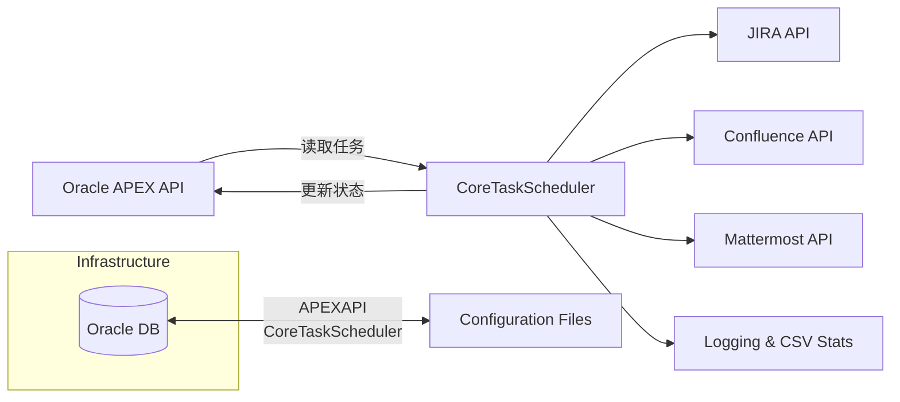

以下文档以 Wiki 风格呈现，涵盖了系统整体设计、模块说明、配置管理、并发与任务管理、日志与测试等方面的内容。可作为团队协同与后续维护的参考。

---

# 目录

1. [概述 (Overview)](#概述-overview)  
2. [系统架构 (System Architecture)](#系统架构-system-architecture)  
3. [功能模块设计 (Module Design)](#功能模块设计-module-design)  
   1. [A. 作业任务加载与状态更新 (Task Loading & Status Update)](#a-作业任务加载与状态更新-task-loading--status-update)  
   2. [B. 数据获取 - JIRA (JIRA Data Retrieval)](#b-数据获取---jira-jira-data-retrieval)  
   3. [C. 数据获取 - Confluence (Confluence Data Retrieval)](#c-数据获取---confluence-confluence-data-retrieval)  
   4. [D. 数据新增、删除、更新 - JIRA (JIRA Data Update)](#d-数据新增删除更新---jira-jira-data-update)  
   5. [E. 数据新增、删除、更新 - Confluence (Confluence Data Update)](#e-数据新增删除更新---confluence-confluence-data-update)  
   6. [F. 作业完成通知 (Task Completion Notification)](#f-作业完成通知-task-completion-notification)  
   7. [G. 配置文件管理 (Configuration Management)](#g-配置文件管理-configuration-management)  
   8. [H. 日志管理 (Logging & Statistics)](#h-日志管理-logging--statistics)  
4. [并发及多线程处理 (Concurrency & Multithreading)](#并发及多线程处理-concurrency--multithreading)  
5. [测试与持续集成/持续交付 (Testing & CI/CD)](#测试与持续集成持续交付-testing--cicd)  
6. [依赖与前置条件 (Dependencies & Prerequisites)](#依赖与前置条件-dependencies--prerequisites)  
7. [部署与运行 (Deployment & Run)](#部署与运行-deployment--run)  
8. [常见问题与故障排查 (FAQ & Troubleshooting)](#常见问题与故障排查-faq--troubleshooting)  
9. [后续优化 (Future Enhancements)](#后续优化-future-enhancements)  

---

## 1. 概述 (Overview)

本系统使用 Python 开发，整合了 Oracle APEX 提供的 API，负责读取并执行配置在 APEX 中的作业 (task)。这些作业将会根据业务需求对 JIRA 和 Confluence 进行增删改查操作，并在完成后以邮件或 Mattermost 的方式通知用户。

系统需满足以下主要目标：  
1. **任务调度**：支持定时任务和即时任务的加载、执行与状态更新。  
2. **多系统集成**：与 JIRA、Confluence、Mattermost 等多种服务进行对接，并可根据配置文件实现多租户支持。  
3. **多线程与高并发**：在操作 JIRA、Confluence 时提升处理速度，利用多线程或线程池进行并行处理。  
4. **可测试、可维护**：符合现代化 CI/CD 要求，易于编写测试、部署与维护。  
5. **记录和统计**：输出详尽日志、执行统计以及 CSV 报表，以便问题追踪与用户使用分析。

---

## 2. 系统架构 (System Architecture)



- **CoreTaskScheduler**：核心任务调度与执行引擎，定时从 APEX API 读取任务或处理即时任务，并调用相关服务（JIRA、Confluence、Mattermost等）的 API 进行操作。  
- **APEX API**：提供查询/更新任务的信息与状态。与 Oracle DB 交互存储、读取和更新。  
- **JIRA API / Confluence API / Mattermost API**：第三方系统的集成点，实现对工单(JIRA ticket)和页面(Confluence page)等数据的读取与写入，以及通知服务（Mattermost）的发送。  
- **Config**：本地或远程配置文件，包含多租户环境配置、字段映射等信息。  
- **Logging & CSV Stats**：日志记录模块，用于输出执行过程的详细信息及统计文件。

---

## 3. 功能模块设计 (Module Design)

### A. 作业任务加载与状态更新 (Task Loading & Status Update)

1. **任务类型**  
   - **即时处理 (Immediate Task)**：用户在界面（APEX）新增并希望立即执行的任务。  
   - **定时处理 (Scheduled Task)**：已在 APEX 界面配置并根据时间规则（如每月第几天、每周哪几天、营业日、周末等）定期执行的任务。

2. **主要流程**  
   1. **读取**：定时（例如每 3 秒或可配置的频率）调用 APEX 提供的 API，获取所有未处理的即时任务。  
   2. **识别并分配**：根据配置或业务逻辑，将任务分配给不同的执行逻辑；对于定时任务，可定期扫描并根据下一次执行时间来“激活”任务。  
   3. **执行状态更新**：任务执行完成后（成功/失败），需要回调或调用 APEX 的更新接口，将执行结果（包括错误消息、结果概要等）写回数据库。  

3. **数据结构示例**  
   ```json
   {
       "task_id": "12345",
       "task_type": "immediate", 
       "schedule_config": {
           "type": "daily",
           "time": "02:00"
       },
       "operation": "update-jira",
       "parameters": {
           "jira_issue_key": "ABC-123",
           "field_changes": {
               "Summary": "Updated Summary"
           }
       }
   }
   ```

### B. 数据获取 - JIRA (JIRA Data Retrieval)

1. **场景**  
   - 根据 APEX 传递的任务指令或业务逻辑，使用 JQL 或特定 Jira Issue Key 等进行查询获取。  
   - 常见需求：获取 JIRA ticket 的某些字段（如 `Summary`, `Description`, `Custom Fields`, 等），并在后续步骤中用于业务处理或写入 Confluence。

2. **实现要点**  
   - **API 调用**：可使用 [Atlassian Python API](https://pypi.org/project/atlassian-python-api/) 或 `requests` 库直接请求 REST 接口。  
   - **认证**：支持不同环境（multi-tenant）的认证方式，如 Basic Auth、OAuth、API Token 等。  
   - **字段映射**：根据配置管理模块，映射字段 `Field A` -> `customfield_12345` 等。

3. **注意事项**  
   - 对于大批量 JIRA 结果，需要分页读取或使用搜索限制（maxResults 等参数），防止一次性获取导致超时或性能瓶颈。  
   - 多线程访问时，需做好线程安全与鉴权 token 重用或刷新策略。

### C. 数据获取 - Confluence (Confluence Data Retrieval)

1. **场景**  
   - 根据任务需求，获取指定 PageID 的内容（body.storage），并对其进行结构化分析。  
   - 解析 XHTML，提取表格数据 (table)、自定义宏 (macro) 等信息，以便进行后续操作（更新、替换等）。

2. **实现要点**  
   - **API 调用**：同样可以使用 [Atlassian Python API](https://pypi.org/project/atlassian-python-api/) 或 `requests`。  
   - **内容解析**：对返回的 XHTML 内容，可使用 `BeautifulSoup` 或类似的 HTML/XML 解析库进行处理。  
   - **宏 (Macro)**：需要检查配置文件中对应的宏是否可用。如果宏不可用，则需要使用预设的替代策略（例如：跳过、使用静态文本替换等）。

3. **注意事项**  
   - Confluence 不同版本在获取页面内容时返回的结构可能会略有不同，需要注意兼容性。  
   - 需留意页面版本控制，更新或删除页面时要知道当前最新版本号以避免冲突。

### D. 数据新增、删除、更新 - JIRA (JIRA Data Update)

1. **场景**  
   - 根据业务需求，对获取到的 JIRA ticket 进行二次操作，如更新字段、添加备注 (comment)、改变状态 (transition)，或者新增/删除工单等。

2. **实现要点**  
   - **更新**：  
     - 如需更新字段，需使用 REST API 的 `PUT`/`POST` 请求，包含正确的字段及值（与配置中的映射对应）。  
     - 如果是 Issue transition，需要提供 valid transition ID。  
   - **新增**：  
     - 创建新 ticket 时，需要确定 `Project Key`, `Issue Type`，以及必填字段。  
   - **删除**：  
     - 需确认当前用户/认证账号是否具备删除权限。  

3. **错误处理**  
   - 提前捕获 JIRA API 异常，如 400 (Bad Request) / 401 (Unauthorized) / 404 (Not Found) 等。  
   - 在任务状态更新时，写回 APEX API 并记录详细错误信息。

### E. 数据新增、删除、更新 - Confluence (Confluence Data Update)

1. **场景**  
   - 需要在 Confluence 新增页面（或子页面）、更新现有页面内容、删除特定页面。  
   - 也可能需要附加文件 (attachment) 或维护页面层级结构。

2. **实现要点**  
   - **更新页面**：  
     - 需在请求中带上当前页面版本号 `version.number`，否则会触发 `Conflict` 错误。  
     - 对内容 body.storage 进行合并/覆盖时，需谨慎处理已有内容。  
   - **新增页面**：  
     - 指定 `spaceKey`，`title` 等属性，可选指定 `parentPageId`。  
   - **删除页面**：  
     - 同样要确认是否具备删除权限，并对下级页面、附件的处理方式做出决定。  

3. **宏处理**  
   - 如果配置中提示某环境不支持特定宏，则需要在更新页面时跳过或替换相关内容。

### F. 作业完成通知 (Task Completion Notification)

1. **通知方式**：  
   - **Email**：可选，使用 SMTP 发送总结内容或错误日志给用户。  
   - **Mattermost**：可选，通过 Webhook 或 Bot 发送短消息给相应频道或用户。

2. **通知内容**：  
   - 任务标识、执行时间、成功/失败状态、错误摘要、产出链接（如 JIRA issue 链接 / Confluence page 链接）等。  
   - 可配置是否发送完整日志或仅发送概要。

3. **扩展性**：  
   - 未来可添加更多消息服务 (Slack、Teams 等)，只需在配置文件中增加对应环境并实现对应的通知函数。

### G. 配置文件管理 (Configuration Management)

1. **多租户支持**  
   - 允许在一个配置文件中定义多个环境 (Env A, Env B, Env C...)。  
   - 每个环境包含其对应的 JIRA base URL, Confluence base URL, Mattermost Webhook/Token 等，以及对应的字段映射。

2. **示例**  
   ```yaml
   environments:
     - name: EnvA
       jira:
         base_url: "https://jiraA.company.com"
         auth: 
           type: "token"
           token: "JIRA_TOKEN_A"
       confluence:
         base_url: "https://confluenceA.company.com"
         auth:
           type: "basic"
           username: "userA"
           password: "passA"
       mattermost:
         webhook_url: "https://mattermostA.company.com/hooks/xxx"
       field_mapping:
         customFields:
           businessName: "customfield_12345"
         issueTypes:
           bug: "Bug"
           task: "Task"
       macros:
         macroA: true
         macroB: false
     - name: EnvB
       ...
   ```

3. **字段映射**  
   - 在 `field_mapping` 中，可以指定 JIRA 与业务名称之间的对应关系，以及可用的 issue types。  
   - 对于 Confluence 宏，也可指定某些宏是否可用。

4. **加载与解析**  
   - 系统启动时或在切换环境时，需要对配置文件进行解析；也可根据任务指定“目标环境”来调用不同配置。

### H. 日志管理 (Logging & Statistics)

1. **日志输出**  
   - 使用 Python 的 `logging` 标准库或第三方库，如 `loguru`。  
   - 按照模块/功能分别输出日志，建议包含：DEBUG, INFO, WARNING, ERROR, CRITICAL 五个级别。

2. **CSV 统计**  
   - 统计内容：任务编号、执行时间、执行耗时、执行结果、错误信息等。  
   - 可将统计结果在一定周期（如每日/每周）导出到 CSV 或存于数据库中。

3. **示例**  
   ```csv
   task_id,task_type,environment,execution_start,execution_end,status,error_message
   12345,immediate,EnvA,2025-01-01T10:00:00,2025-01-01T10:00:03,success,""
   67890,scheduled,EnvB,2025-01-02T02:00:00,2025-01-02T02:00:05,fail,"Transition ID not found"
   ```

---

## 4. 并发及多线程处理 (Concurrency & Multithreading)

1. **多线程目的**  
   - 提升对 JIRA/Confluence 大量数据操作的吞吐量，减少等待时间。  
   - 例如批量更新数百条 JIRA ticket，或批量解析多个 Confluence 页面。

2. **实现方式**  
   - 在 Python 中，通常可使用 `threading`、`concurrent.futures.ThreadPoolExecutor` 或 `asyncio`（若使用异步 IO）等方式。  
   - 建议在核心调度器中维护一个线程池 (例如 `ThreadPoolExecutor(max_workers=5)`)。

3. **状态共享**  
   - 每个线程在处理任务时，需要共享：  
     - 目标环境的配置信息（认证 Token、Base URL、字段映射等）。  
     - 任务上下文信息（task_id、日志跟踪 ID 等）。  
   - 同一资源（如同一个 JIRA ticket）的并发更新需要谨慎，可能需要加锁或先合并更新内容后再一次提交。

4. **出错回退 (Error Handling)**  
   - 如果某条线程任务出错，需要确保不会影响其他线程任务的执行。  
   - 对于需要整体回滚的场景，可通过设计事务型逻辑或在后续的补偿机制中实现。

---

## 5. 测试与持续集成/持续交付 (Testing & CI/CD)

1. **单元测试 (Unit Tests)**  
   - 对每个模块（如 JIRA API 调用、Confluence API 调用、APEX API 调用）进行mock测试，确保函数行为正确。  
   - 对配置文件解析、字段映射、宏解析等关键逻辑进行测试。

2. **集成测试 (Integration Tests)**  
   - 在测试环境（使用测试 JIRA / Confluence / APEX）进行端到端的流程测试。  
   - 包括：定时任务正确调度、即时任务能立即执行、更新/删除/创建操作正确完成，及错误场景处理。  

3. **CI/CD**  
   - 建议在版本控制工具（如 GitLab/GitHub）上配置 CI Pipeline：  
     1. 安装依赖（Python 包）  
     2. 运行单元测试  
     3. 运行集成测试（可选自动或手动触发）  
     4. 构建并打包（Docker 镜像或可执行包）  
   - CD 部署到测试环境或生产环境时，需要先检验所有测试通过。

---

## 6. 依赖与前置条件 (Dependencies & Prerequisites)

1. **Python 版本**：建议使用 Python 3.8+，以便获得更佳的性能与功能支持。  
2. **第三方库**：  
   - `requests` / `httpx`：HTTP 请求库  
   - `atlassian-python-api`（可选）：方便 Jira/Confluence 的操作  
   - `beautifulsoup4`：解析 Confluence 的 XHTML 内容  
   - `pyyaml`：解析 YAML 配置文件  
   - `pandas`（可选）：数据统计、CSV 写入  
3. **网络访问**：  
   - 能正常访问 JIRA/Confluence/Mattermost/Oracle APEX API 的网络与 DNS 配置。  
4. **环境权限**：  
   - 拥有对 JIRA 的读写权限、对 Confluence 的读写权限、Mattermost Webhook/Bot 权限等。  
   - 对 Oracle APEX API（和其数据库）的读写权限。

---

## 7. 部署与运行 (Deployment & Run)

1. **部署方式**  
   - **容器化 (Docker)**：将代码及依赖一起打包为 Docker 镜像，可在任何支持 Docker 的环境中运行。  
   - **裸机或虚拟机部署**：在 Python 环境中通过 `pip install -r requirements.txt` 安装依赖后运行。

2. **启动脚本示例**  
   ```bash
   #!/bin/bash
   source venv/bin/activate
   export PYTHONPATH=.
   python main.py --config ./config.yaml
   ```

3. **运行参数**  
   - `--config <path>`：指定配置文件路径。  
   - `--env <name>`：指定默认环境（多环境切换）。  
   - `--log-level <level>`：控制日志详细程度。  

4. **守护进程**  
   - 可使用 `supervisord` 或 systemd 方式将该程序常驻运行，每隔固定时间间隔（如 3 秒）执行扫描/调度。

---

## 8. 常见问题与故障排查 (FAQ & Troubleshooting)

1. **无法连接 JIRA**  
   - 检查网络连通性、认证方式 (token/username+password)、Base URL 是否正确。  
   - 在日志中搜索具体错误码（401/403/404 等）。  

2. **Confluence 页面更新冲突**  
   - 可能因页面版本号过期，需要先获取最新版本再更新。  
   - 检查是否有其他进程/用户同时更新同一页面。  

3. **定时任务未触发**  
   - 检查调度器主循环是否正在运行；确认定时配置是否正确识别日期/周末设置等。  

4. **宏渲染错误**  
   - 确认对应环境是否安装了该宏；必要时在配置文件中关闭该宏或采用替代策略。  

5. **任务执行缓慢**  
   - 检查多线程池数量设置；JIRA/Confluence API 限流限制；网络带宽；数据库响应是否正常。  

---

## 9. 后续优化 (Future Enhancements)

1. **自动重试机制**  
   - 针对网络抖动或临时错误 (5xx 错误) 提供重试；对特定的错误（如 400 Bad Request）则立即失败。  

2. **更灵活的定时调度**  
   - 整合如 `APScheduler` 或 `Celery` 等专业调度框架，支持 CRON 表达式。  

3. **界面化操作**  
   - 提供前端界面查看任务队列、手动触发或取消任务、查看日志等功能。  

4. **审计日志**  
   - 对每次更新/删除的操作记录用户信息，以满足合规或审计需求。  

5. **扩展更多第三方系统**  
   - 如 Slack, Microsoft Teams, GitLab/GitHub Issue, etc. 

---

> **备注**  
> - 本说明文件可在团队 Wiki 中维护和完善，随着需求和功能的变化不断更新。  
> - 以上所述的模块划分、配置示例和实现要点，适用于大部分 Python 项目在集成 JIRA/Confluence/Mattermost/Oracle APEX 场景下的需求。  
> - 在具体实现时，应根据企业环境的限制（网络、权限、版本等）做出相应调整。

---

**End of Wiki**
