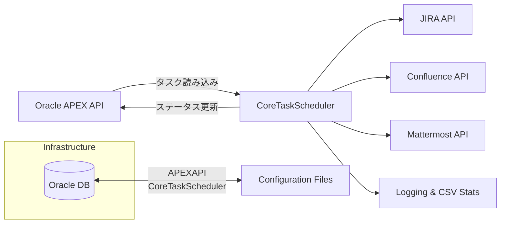

以下のドキュメントは、システム全体の設計、モジュール構成、設定管理、並列処理・タスク管理、ログ・テストなどの観点をカバーし、Wiki形式でまとめたものです。日本のIT企業での利用を想定し、Pythonでの実装や企業環境下での運用を意識した内容となっています。

---

# 目次

1. [概要 (Overview)](#概要-overview)  
2. [システムアーキテクチャ (System Architecture)](#システムアーキテクチャ-system-architecture)  
3. [機能モジュール設計 (Module Design)](#機能モジュール設計-module-design)  
   1. [A. 作業タスクのロードとステータス更新 (Task Loading & Status Update)](#a-作業タスクのロードとステータス更新-task-loading--status-update)  
   2. [B. データ取得 - JIRA (JIRA Data Retrieval)](#b-データ取得---jira-jira-data-retrieval)  
   3. [C. データ取得 - Confluence (Confluence Data Retrieval)](#c-データ取得---confluence-confluence-data-retrieval)  
   4. [D. データ新規作成・削除・更新 - JIRA (JIRA Data Update)](#d-データ新規作成削除更新---jira-jira-data-update)  
   5. [E. データ新規作成・削除・更新 - Confluence (Confluence Data Update)](#e-データ新規作成削除更新---confluence-confluence-data-update)  
   6. [F. 作業完了時の通知 (Task Completion Notification)](#f-作業完了時の通知-task-completion-notification)  
   7. [G. 設定ファイル管理 (Configuration Management)](#g-設定ファイル管理-configuration-management)  
   8. [H. ログ管理 (Logging & Statistics)](#h-ログ管理-logging--statistics)  
4. [並列処理・マルチスレッド対応 (Concurrency & Multithreading)](#並列処理マルチスレッド対応-concurrency--multithreading)  
5. [テストとCI/CD (Testing & CI/CD)](#テストとcicd-testing--cicd)  
6. [依存関係と前提条件 (Dependencies & Prerequisites)](#依存関係と前提条件-dependencies--prerequisites)  
7. [デプロイと実行 (Deployment & Run)](#デプロイと実行-deployment--run)  
8. [よくある問題とトラブルシューティング (FAQ & Troubleshooting)](#よくある問題とトラブルシューティング-faq--troubleshooting)  
9. [将来的な拡張 (Future Enhancements)](#将来的な拡張-future-enhancements)  

---

## 1. 概要 (Overview)

本システムは、Pythonで開発され、Oracle APEXが提供するAPIを利用して、APEX上に設定された作業（task）を読み込み・実行するための仕組みです。これらの作業は、JIRAやConfluenceに対して、ビジネス要件に応じた作業（データの取得・新規作成・更新・削除など）を行い、完了後にメールやMattermostで通知します。

主な目的は以下のとおりです。  
1. **タスクスケジューリング**：定期タスクおよび即時タスクのロード・実行とステータス管理。  
2. **複数システムとの連携**：JIRA、Confluence、Mattermostなどのサービス連携、かつ設定ファイルでマルチテナント環境を簡単に切り替え可能。  
3. **マルチスレッドと高並列**：JIRAやConfluenceへの大量のリクエストを効率良く実行するため、並列処理によりパフォーマンスを向上。  
4. **テスト容易性・保守性**：モダンなCI/CDを想定し、単体テストや統合テストを容易に行える設計。  
5. **記録と統計**：詳細なログ出力、実行統計、およびCSVなどでのレポート出力によるトラブルシューティングや利用分析。

---

## 2. システムアーキテクチャ (System Architecture)



- **CoreTaskScheduler**：主要なタスクスケジューラ兼実行エンジン。APEX APIから定期的にタスクを読み込み、JIRA・Confluence・MattermostなどのAPIを呼び出してタスクを実行し、完了後にAPEXのDBへ状態を更新する。  
- **APEX API**：タスク情報を提供・更新するAPI。Oracle DBと連携してタスク情報を取得・格納。  
- **JIRA API / Confluence API / Mattermost API**：外部サービスのAPI。JIRAチケットやConfluenceページの操作、通知送信などを行う。  
- **Config**：マルチテナント環境を管理する設定ファイル。JIRA, Confluence, MattermostのURLや認証情報、フィールドマッピングなどを定義。  
- **Logging & CSV Stats**：ログ出力と実行統計を担うモジュール。トラブルシューティングと利用分析をサポート。

---

## 3. 機能モジュール設計 (Module Design)

### A. 作業タスクのロードとステータス更新 (Task Loading & Status Update)

1. **タスク種類**  
   - **即時実行タスク (Immediate Task)**：APEXのUIからユーザーが新規作成し、すぐに実行を要求するタスク。  
   - **定期実行タスク (Scheduled Task)**：APEX上であらかじめスケジュール設定（毎月の特定日、毎週の特定曜日、営業日/週末など）を行い、その時間になると自動的に実行されるタスク。

2. **主なフロー**  
   1. **取得**：一定間隔（例：3秒など、設定可能な頻度）でAPEX APIを呼び出し、未処理の即時タスクを取得。  
   2. **識別と振り分け**：タスクの設定を読み取り、必要に応じて定期タスクをスケジュールに登録。また、即時タスクは即座に実行キューへ投入。  
   3. **ステータス更新**：タスク実行完了後（成功/失敗）、APEX側の更新用APIを呼び出して結果（エラーメッセージや概要など）を格納する。  

3. **データ構造例**  
   ```json
   {
       "task_id": "12345",
       "task_type": "immediate", 
       "schedule_config": {
           "type": "daily",
           "time": "02:00"
       },
       "operation": "update-jira",
       "parameters": {
           "jira_issue_key": "ABC-123",
           "field_changes": {
               "Summary": "Updated Summary"
           }
       }
   }
   ```

### B. データ取得 - JIRA (JIRA Data Retrieval)

1. **シナリオ**  
   - APEXからのタスク指示やビジネスロジックに基づき、JQLまたはJira Issue Keyなどを使用してJIRAチケット情報を取得。  
   - 例：`Summary`, `Description`, `カスタムフィールド`などのフィールドを取得し、その後のConfluenceへの書き込みや他のビジネス処理に利用。

2. **実装ポイント**  
   - **API呼び出し**： [Atlassian Python API](https://pypi.org/project/atlassian-python-api/) や `requests` モジュールを用いてREST APIにアクセス。  
   - **認証**：マルチテナント対応のため、Basic AuthやOAuth、APIトークンなど、環境によって異なる認証方式をサポート。  
   - **フィールドマッピング**：設定ファイルでフィールド名（ビジネス名）と`customfield_12345`などの実際のフィールドキーを対応付け。

3. **注意点**  
   - 大量のJIRAチケットを扱う場合は、ページングや`maxResults`パラメータを活用し、一度に取得しすぎてタイムアウトしないようにする。  
   - マルチスレッドで同時に呼び出す場合、トークンの使い回しや更新を適切に管理。

### C. データ取得 - Confluence (Confluence Data Retrieval)

1. **シナリオ**  
   - タスクで指定されたPageIDに対応するConfluenceページ(body.storage)を取得し、その内容を構造化して解析。  
   - XHTMLをパースし、テーブル要素（table）やカスタムマクロ（macro）などを抽出・解析して後続の処理に活用。

2. **実装ポイント**  
   - **API呼び出し**： [Atlassian Python API](https://pypi.org/project/atlassian-python-api/) や`requests`でConfluence REST APIを叩く。  
   - **内容の解析**：取得したXHTMLを `BeautifulSoup` やHTML/XMLパーサで解析。  
   - **マクロ（Macro）**：環境で使用可能かどうかを設定ファイルでチェック。不可能な場合は置き換えやスキップなどの処理を行う。

3. **注意点**  
   - Confluenceのバージョン差異により、APIレスポンスの構造が異なる場合があるため、互換性を確認。  
   - ページのバージョン管理に注意。更新時に競合が起きないよう、最新バージョンを取得してから操作を行う。

### D. データ新規作成・削除・更新 - JIRA (JIRA Data Update)

1. **シナリオ**  
   - 取得したJIRAチケットの内容を編集（フィールド更新、コメント追加、ステータス変更など）する。  
   - 新規Issueの作成や既存Issueの削除なども含む。

2. **実装ポイント**  
   - **更新**：  
     - フィールド更新には正しいフィールドキーや値を指定。ステータス遷移の場合は有効なtransition IDが必要。  
   - **新規作成**：  
     - `Project Key`、`Issue Type`、必須フィールドを揃えた上でPOSTする。  
   - **削除**：  
     - 削除権限が必要。APIのHTTPステータスやエラーメッセージをキャッチして管理。

3. **エラーハンドリング**  
   - 400（Bad Request）/ 401（Unauthorized）/ 404（Not Found）などのHTTPエラーを検知し、タスクの失敗情報としてAPEXに返却・記録。

### E. データ新規作成・削除・更新 - Confluence (Confluence Data Update)

1. **シナリオ**  
   - Confluenceで新規ページや子ページの作成、既存ページ内容の更新、不要ページの削除などを実行。  
   - 必要に応じて添付ファイル(attachment)やページの階層構造も管理。

2. **実装ポイント**  
   - **ページ更新**：  
     - 最新の`version.number`を指定しないと`Conflict`エラーとなるため、事前に現在のバージョン情報を取得。  
     - body.storageの一部を置き換える場合は、既存のデータとマージまたは差し替えの方法を検討。  
   - **新規ページ作成**：  
     - `spaceKey`、`title`などを指定し、必要に応じて`parentPageId`を設定。  
   - **削除**：  
     - 削除権限の確認。子ページや添付ファイルの扱いに注意。

3. **マクロ対応**  
   - 環境ごとにインストール済みマクロが異なる場合、対応不可マクロが存在すればスキップやプレーンテキストへの置き換えを行うなど、設定ファイルを参照しつつ処理。

### F. 作業完了時の通知 (Task Completion Notification)

1. **通知方法**  
   - **メール (Email)**：SMTPを利用してユーザーへ結果やエラーレポートを送信（オプション）。  
   - **Mattermost**：WebhookまたはBotアカウントを利用してチャンネルやユーザーに通知（オプション）。

2. **通知内容**  
   - タスクID、実行時間、成功/失敗、エラー内容やリンク（JIRAチケット/Confluenceページなど）を含むサマリーを送付。  
   - 必要に応じてログの抜粋や詳細を添付/共有。

3. **拡張性**  
   - 将来的にSlackやTeamsなど別の通知先へ拡張可能。設定ファイルで環境情報を追加し、対応する通知関数を実装するだけで対応。

### G. 設定ファイル管理 (Configuration Management)

1. **マルチテナント対応**  
   - 1つの設定ファイルに複数の環境（Env A、Env B、Env Cなど）を定義。  
   - 環境ごとにJIRA、Confluence、Mattermostの接続情報やフィールドマッピングを切り替えられる。

2. **設定例**  
   ```yaml
   environments:
     - name: EnvA
       jira:
         base_url: "https://jiraA.company.com"
         auth: 
           type: "token"
           token: "JIRA_TOKEN_A"
       confluence:
         base_url: "https://confluenceA.company.com"
         auth:
           type: "basic"
           username: "userA"
           password: "passA"
       mattermost:
         webhook_url: "https://mattermostA.company.com/hooks/xxx"
       field_mapping:
         customFields:
           businessName: "customfield_12345"
         issueTypes:
           bug: "Bug"
           task: "Task"
       macros:
         macroA: true
         macroB: false
     - name: EnvB
       ...
   ```

3. **フィールドマッピング**  
   - `field_mapping` セクションで、JIRAのビジネス名を`customfield_xxx`などにマッピング。  
   - Confluenceのマクロ利用可否なども設定する。

4. **読み込みと解析**  
   - システム起動時あるいは環境切り替え時にファイルをパース。タスクごとにどの環境を使用するか判断してAPI呼び出しに利用。

### H. ログ管理 (Logging & Statistics)

1. **ログ出力**  
   - Pythonの標準`logging`モジュール、または`loguru`などを利用。  
   - モジュール/機能単位でログを管理し、DEBUG/INFO/WARNING/ERROR/CRITICALなどのレベルを使い分ける。

2. **CSVでの統計出力**  
   - タスクID、実行開始/終了日時、所要時間、ステータス、エラーメッセージなどを集計し、定期的にCSVへ書き出す。  
   - またはデータベースに保存して集計・分析に活用することも可能。

3. **例**  
   ```csv
   task_id,task_type,environment,execution_start,execution_end,status,error_message
   12345,immediate,EnvA,2025-01-01T10:00:00,2025-01-01T10:00:03,success,""
   67890,scheduled,EnvB,2025-01-02T02:00:00,2025-01-02T02:00:05,fail,"Transition ID not found"
   ```

---

## 4. 並列処理・マルチスレッド対応 (Concurrency & Multithreading)

1. **マルチスレッドの目的**  
   - JIRAやConfluenceなどに対する大量のAPIリクエストを効率化し、処理速度を向上させる。  
   - 例：数百件のJIRAチケット更新や複数のConfluenceページを同時に解析。

2. **実装方法**  
   - Pythonの`threading`、`concurrent.futures.ThreadPoolExecutor`、もしくは`asyncio`による非同期IOを利用。  
   - メインのスケジューラで`ThreadPoolExecutor(max_workers=5)`などのスレッドプールを管理する実装が一般的。

3. **状態共有**  
   - スレッドごとに、対象環境設定（認証トークン、Base URL、フィールドマッピング）やタスクコンテキスト（task_id、ログトレースIDなど）を共有する必要がある。  
   - 同一リソース（同じJIRAチケットなど）を同時更新する場合、ロックや先に内容をマージするなど衝突回避が必要。

4. **エラー時のリカバリ (Error Handling)**  
   - あるスレッドの処理でエラーが発生しても、他スレッドに影響を与えない設計。  
   - 必要に応じて、処理失敗時に再試行（リトライ）や補償処理を検討。

---

## 5. テストとCI/CD (Testing & CI/CD)

1. **単体テスト (Unit Tests)**  
   - JIRA/Confluence/APEX API呼び出し部分はモック化してテスト。  
   - 設定ファイルの解析、フィールドマッピング、マクロパースなどの重要ロジックもカバレッジを確保。

2. **統合テスト (Integration Tests)**  
   - テスト環境（テスト用JIRA/Confluence/APEX）を使い、エンドツーエンドでの動作を検証。  
   - 定期タスクの実行、即時タスクの即時処理、更新や削除などのAPI動作を確認。

3. **CI/CD**  
   - GitLab/GitHubなどのCIパイプライン構築例：  
     1. 依存パッケージインストール（Pythonライブラリ）  
     2. 単体テストの実行  
     3. （必要に応じて）統合テストの実行  
     4. Dockerイメージや実行バイナリのビルドとデプロイ  
   - リリース前にすべてのテストを通過したことを確認し、ステージング/本番環境にデプロイ。

---

## 6. 依存関係と前提条件 (Dependencies & Prerequisites)

1. **Pythonバージョン**：Python 3.8以上を推奨。  
2. **サードパーティライブラリ**：  
   - `requests` / `httpx`：HTTP通信  
   - `atlassian-python-api`（任意）：JIRA/Confluence操作を簡易化  
   - `beautifulsoup4`：Confluence XHTMlの解析  
   - `pyyaml`：YAML設定ファイルの読み込み  
   - `pandas`（任意）：CSVなどの統計処理  
3. **ネットワーク環境**：  
   - JIRA / Confluence / Mattermost / Oracle APEX APIへのネットワーク到達性  
4. **環境権限**：  
   - JIRA / Confluence / Mattermost / Oracle DB（APEX）等への読み書き権限  
   - SSL証明書など必要に応じて設定

---

## 7. デプロイと実行 (Deployment & Run)

1. **デプロイ方法**  
   - **コンテナ化 (Docker)**：コードと依存ライブラリを1つのDockerイメージにまとめ、任意のDocker対応環境へデプロイ。  
   - **オンプレ/VM**：`pip install -r requirements.txt` でライブラリをインストールし、Pythonスクリプトを実行。

2. **起動スクリプト例**  
   ```bash
   #!/bin/bash
   source venv/bin/activate
   export PYTHONPATH=.
   python main.py --config ./config.yaml
   ```

3. **実行時オプション**  
   - `--config <path>`：設定ファイルのパスを指定。  
   - `--env <name>`：デフォルト使用環境を指定。  
   - `--log-level <level>`：ログレベルを切り替え。  

4. **常駐プロセス**  
   - `supervisord`やsystemdなどで常駐化し、定期的（例：3秒ごと）にタスクをスキャン・実行する。

---

## 8. よくある問題とトラブルシューティング (FAQ & Troubleshooting)

1. **JIRAに接続できない**  
   - ネットワーク設定・DNS・認証方式 (token/username+password)・Base URLを再確認。  
   - ログでHTTPステータス(401/403/404など)を確認。  

2. **Confluenceページの更新競合**  
   - ページバージョン番号が古い可能性あり。最新バージョンを取得し直して更新。  
   - 他ユーザー/プロセスが同時編集している可能性もある。

3. **定期タスクが動作しない**  
   - スケジューラが起動しているか確認。APEXで設定した日時や周期が正しく判定されているか。  

4. **マクロが正しくレンダリングされない**  
   - 環境に対応マクロがインストールされているか。インストールされていないマクロが設定ファイルで有効になっていないか。  

5. **タスク実行が遅い**  
   - マルチスレッド数（スレッドプールサイズ）を調整。JIRA/ConfluenceのAPI呼び出し制限やネットワーク帯域も要確認。  
   - データベース（APEX側）応答速度なども考慮。

---

## 9. 将来的な拡張 (Future Enhancements)

1. **自動リトライ機能**  
   - ネットワーク障害や一時的な5xxエラーに対して、再試行処理を組み込み。  
   - 400系エラー（Bad Requestなど）は即座に失敗として扱う。

2. **柔軟なスケジューリング**  
   - `APScheduler` や `Celery`などのフレームワークを採用し、CRON表現など多彩なスケジュール機能をサポート。  

3. **UIの拡充**  
   - タスク一覧、実行ログのモニタリング、手動トリガーやキャンセル機能などを提供するWebフロントを実装。  

4. **監査ログ**  
   - 変更や削除が行われた場合、だれがいつ何を行ったかなどの監査情報を保持し、コンプライアンス対応を強化。  

5. **さらなる外部サービス対応**  
   - Slack、Microsoft Teams、GitLab/GitHub Issuesなど、追加の連携先を容易に組み込めるプラグイン構造を整備。 

---

> **備考**  
> - 本ドキュメントはチームのWikiとして運用し、要件や仕様の変化に伴って更新することを想定しています。  
> - 上述のモジュール構成、設定例、実装ポイントなどは、一般的なPythonプロジェクトがJIRA/Confluence/Mattermost/Oracle APEXとの連携を行う際の標準的なガイドラインです。  
> - 実際の実装では、企業固有のネットワーク・権限・バージョンなどに合わせて調整してください。

---

**End of Wiki**
